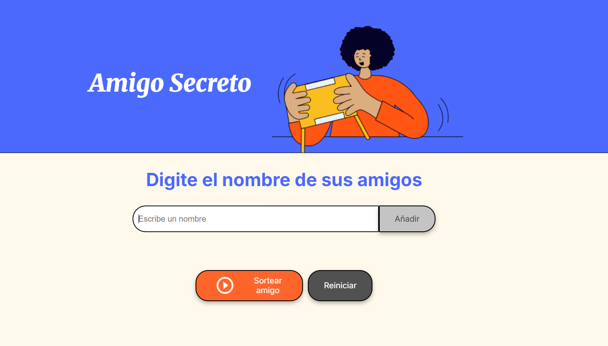

# Amigo-Secreto-Challenge-ONE

## Índice

* [1. Resumen del proyecto](#1-resumen-del-proyecto)
* [2. Descripción del proyecto](#2-descripción-del-proyecto)  
* [3. Tecnologías utilizadas](#3-tecnologías-utilizadas)
* [4. Acceso al proyecto](#4-acceso-al-proyecto)

***

## 1. Resumen del proyecto

El Challenge Amigo Secreto forma parte de la formación del programa ONE (Oracle Next Education) en los cursos de Principiante en Programación. El objetivo principal de este desafío es desarrollar habilidades en lógica de programación, por eso el HTML y CSS ya venían preparados. De esta manera, nuestro enfoque es exclusivamente en construir la lógica del código JavaScript, aplicando conceptos clave como funciones, arrays, condicionales y variables.

## 2. Descripción del proyecto

### Vista previa del proyecto

### Campo para ingresar nombres
* Los nombres deben ser ingresados de uno en uno
* Si el campo está vacío, se mostrará una alerta indicando que debes ingresar un nombre

### Botón para añadir amigos a la lista
* Puedes ingresar amigos a la lista haciendo click en el botón "Añadir"

### Botón para sortear amigos
* Una vez que estén todos tus amigos en la lista, pulsa "Sortear Amigos" para elegir el amigo secreto

### Botón para reiniciar
* Permite reiniciar el juego y comenzar nuevamente

## 3. Tecnologías utilizadas

* HTML y CSS (Proporcionados por el programa ONE)
* JavaScript

## 4. Acceso al proyecto

**Link al proyecto:** [Agregar el link aquí]

**Instrucciones para ejecutar el proyecto:**
1. Clonar el repositorio
2. Abrir el archivo `index.html` en tu navegador
